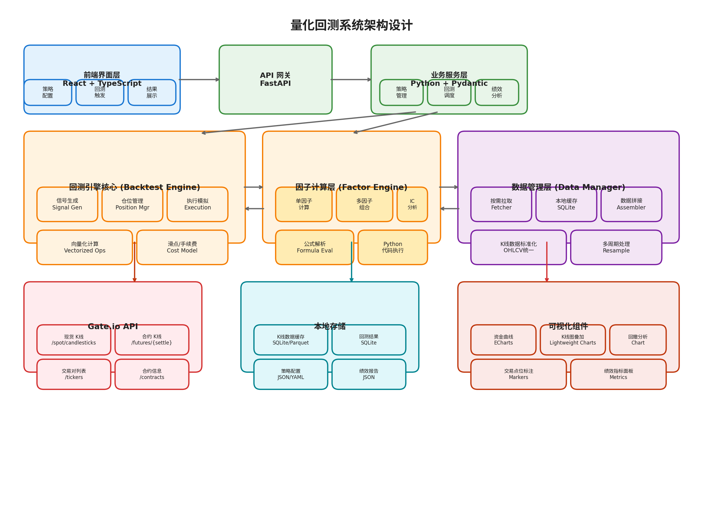
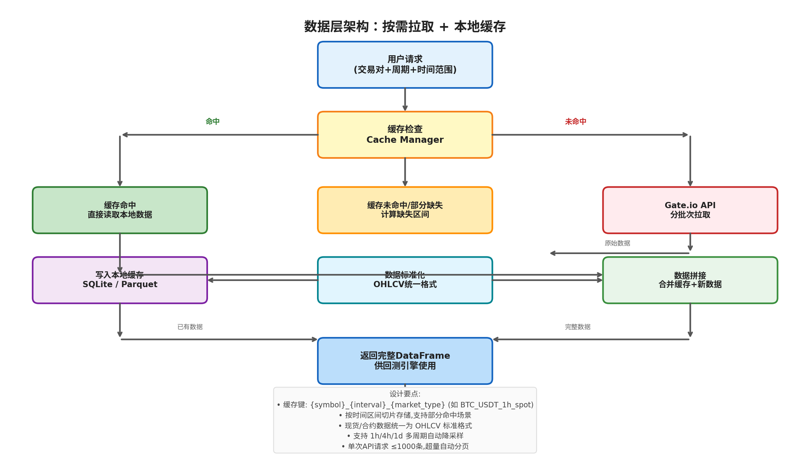
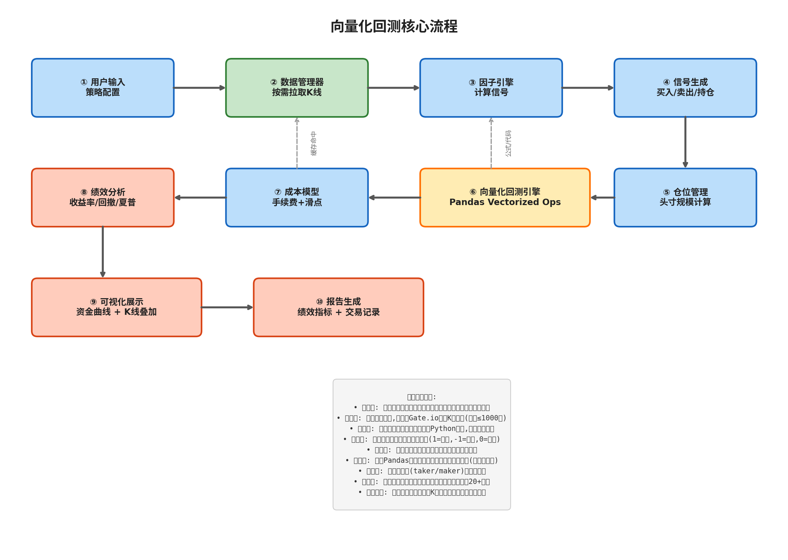

# 基于 Gate.io API 的加密货币量化回测系统 — 技术方案

---

## 1. 项目概述

### 1.1 目标

构建一个支持 **现货 + 合约** 双市场的加密货币量化交易回测系统。用户通过 Web 界面输入因子公式或 Python 代码作为策略信号，系统从 **Gate.io API v4** 按需拉取历史 K 线数据，执行向量化回测，并输出完整的绩效分析报告与可视化图表。系统暂不接实盘，面向不超过 10 人的研究型用户群体。

### 1.2 核心功能

| 功能模块 | 说明 |
|---------|------|
| **数据管理** | 从 Gate.io 按需拉取现货/合约 K 线数据，支持本地缓存，自动处理分页 |
| **因子输入** | 支持公式表达式（如 `MA(close,5) > MA(close,20)`）和原生 Python 代码两种模式 |
| **多因子组合** | 支持多因子加权组合、IC 分析、因子相关性检测 |
| **向量化回测** | 基于 Pandas/Numpy 的向量化运算，毫秒级完成历史回测 |
| **绩效评估** | 20+ 项绩效指标（年化收益、夏普比率、最大回撤、Calmar 比率等） |
| **Web 可视化** | 资金曲线、K 线叠加买卖标记、回撤分析、绩效面板 |

---

## 2. 系统架构

### 2.1 整体架构图



### 2.2 分层设计

系统采用经典的分层架构，共六个核心层：

| 层级 | 技术选型 | 职责 |
|------|---------|------|
| **前端层** | React 18 + TypeScript + Vite | 用户交互界面、策略配置、图表展示 |
| **API 网关层** | FastAPI + Uvicorn | RESTful API 服务、请求路由、参数校验 |
| **业务服务层** | Python + Pydantic | 策略管理、回测调度、绩效分析编排 |
| **回测引擎层** | Pandas + NumPy | 向量化回测核心、信号执行、仓位管理 |
| **因子引擎层** | Pandas + NumPy + AST | 因子计算、公式解析、Python 代码沙箱执行 |
| **数据管理层** | SQLite + Parquet + aiohttp | Gate.io 数据按需拉取、本地缓存、数据标准化 |

---

## 3. 技术选型详解

### 3.1 后端技术栈

| 组件 | 选型 | 版本 | 用途 |
|------|------|------|------|
| 运行时 | Python | 3.11+ | 后端运行环境 |
| Web 框架 | FastAPI | ≥0.110 | 异步 Web API 框架，自动生成 OpenAPI 文档 |
| 数据校验 | Pydantic | v2 | 请求/响应模型定义与校验 |
| 数据处理 | Pandas | ≥2.0 | K 线数据处理、向量化回测运算 |
| 数值计算 | NumPy | ≥1.24 | 高性能数组运算 |
| 技术指标 | pandas-ta / TA-Lib | 最新 | 内置技术指标计算（MA、RSI、MACD 等） |
| HTTP 客户端 | aiohttp / httpx | 最新 | 异步请求 Gate.io API |
| 数据存储 | SQLite | 内置 | K 线缓存、回测结果、策略配置持久化 |
| 序列化 | Parquet (pyarrow) | 最新 | 大规模 K 线数据高效存储 |

**选择 FastAPI 而非 Flask/Django 的理由**：FastAPI 原生支持异步（async/await），在数据拉取和回测计算场景下可充分利用 I/O 并发；自动生成的 OpenAPI/Swagger 文档降低了前后端联调成本；Pydantic v2 的校验性能比 Flask 的手动校验快 10 倍以上  [(Fire Quantitative Trading System)](https://cosmic.cloud/architecture/overview/) 。

**选择 Pandas 向量化回测而非事件驱动的理由**：向量化回测通过 NumPy 的 C 级数组运算一次性处理整个时间序列，速度比 Python 级别的逐 bar 循环快 **100-1000 倍**  [(Wingspan & Facts)](https://asmr.education/faq/python-market-trading/vectorized-event-driven-backtesting-differences) 。对于日/4h/1h 级别的中低频策略，向量化回测完全满足需求，参数调优和因子筛选的反馈循环近乎实时。

### 3.2 前端技术栈

| 组件 | 选型 | 版本 | 用途 |
|------|------|------|------|
| 框架 | React | 18+ | UI 组件化框架 |
| 语言 | TypeScript | 5.0+ | 类型安全，减少运行时错误 |
| 构建工具 | Vite | 5.0+ | 极速开发服务器和构建 |
| UI 组件 | Ant Design / shadcn | 最新 | 企业级 UI 组件库 |
| K 线图表 | TradingView Lightweight Charts | 最新 | 专业金融 K 线图表 |
| 数据图表 | ECharts / Recharts | 最新 | 资金曲线、回撤分析等 |
| HTTP 客户端 | Axios | 最新 | 后端 API 通信 |

### 3.3 Gate.io API 接入

Gate.io API v4 提供了完整的现货和合约市场数据接口  [(百度)](http://www.baidu.com/link?url=0wXPMiB2O8Jw9lLywMHFIgOqm3NlECF6Da4R7DTyy3kHeye98YD7g66b1YuIeLb_sBBRA3ob3w4aDh2mYGiVJ_) ：

**现货 K 线数据**

- 端点：`GET https://api.gateio.ws/api/v4/spot/candlesticks`
- 返回格式：`[时间戳, 交易量, 收盘价, 最高价, 最低价, 开盘价]`（顺序为 t, v, c, h, l, o）
- 关键参数：`currency_pair`（如 `BTC_USDT`）、`interval`（`1h`/`4h`/`1d`）、`from`/`to`（Unix 秒级时间戳）、`limit`（最大 1000）

**合约 K 线数据**

- 端点：`GET https://api.gateio.ws/api/v4/futures/{settle}/candlesticks`
- `settle` 参数支持 `usdt`（USDT 本位）和 `btc`（BTC 本位）
- 关键参数：`contract`（如 `BTC_USDT`）、`interval`、`from`/`to`、`limit`（最大 2000）
- 特殊用法：contract 前加 `mark_` 前缀获取标记价格 K 线，加 `index_` 前缀获取指数价格 K 线  [(Github)](https://github.com/gateio/gateapi-js/blob/master/docs/FuturesApi.md) 

**认证机制**

- 公有接口（K 线数据）无需认证
- 私有接口采用 **HMAC-SHA512** 签名  [(Public APIs)](https://publicapis.io/gates-io-api) 
- 签名格式：`HMAC_SHA512(secret, "{timestamp}\n{method}\n{path}\n{query}\n{body}")`
- 请求头：`KEY: {api_key}`, `Timestamp: {timestamp}`, `SIGN: {signature}`

---

## 4. 数据层设计

### 4.1 数据流架构



### 4.2 按需拉取策略

系统采用 **"缓存优先、按需补全"** 的数据策略，避免重复拉取已获取的历史数据：

**缓存键设计**：`{symbol}_{interval}_{market_type}`，例如 `BTC_USDT_1h_spot`、`ETH_USDT_4h_futures_usdt`

**数据拉取流程**：

1. 用户请求 `BTC_USDT` 在 `1h` 周期下 `2024-01-01` 到 `2024-06-01` 的数据
2. 缓存管理器检查本地是否已有该交易对+周期+市场类型的数据
3. **完全命中**：直接读取本地 SQLite/Parquet，零 API 调用
4. **部分缺失**：计算缺失的时间区间，仅对该区间发起 API 请求
5. **完全未命中**：计算总数据量，按单次最大限制分页拉取

**分页拉取逻辑**：

- 现货：单次最大 1000 条，按 `from`+`to` 时间范围分页
- 合约：单次最大 2000 条（注意 `limit` 与 `from`/`to` 互斥  [(Github)](https://github.com/gateio/gateapi-python/issues/100) ）
- 自动计算页数：`pages = ceil(total_needed / page_size)`
- 请求间隔：Gate.io 未公开明确限流，建议 **200ms** 间隔保守策略

**存储格式选择**：

| 场景 | 格式 | 理由 |
|------|------|------|
| K 线缓存（< 100万条） | SQLite | 轻量、无需额外服务、支持时间范围查询 |
| K 线缓存（≥ 100万条） | Parquet | 压缩率高、列式存储、Pandas 原生支持 |
| 回测结果 | SQLite | 结构化查询、策略对比 |
| 策略配置 | JSON/YAML | 可读性强、版本控制友好 |

### 4.3 数据标准化

Gate.io 现货和合约返回的 K 线字段顺序不同，数据层需要统一转换为标准 **OHLCV** 格式：

```python
# 标准化后的 DataFrame 结构
df = pd.DataFrame({
    'timestamp': pd.DatetimeIndex,   # 时间戳（UTC）
    'open': float,                   # 开盘价
    'high': float,                   # 最高价
    'low': float,                    # 最低价
    'close': float,                  # 收盘价
    'volume': float,                 # 成交量
    'market_type': str,              # 'spot' | 'futures_usdt' | 'futures_btc'
    'symbol': str,                   # 'BTC_USDT'
    'interval': str,                 # '1h' | '4h' | '1d'
})
```

---

## 5. 因子引擎设计

### 5.1 因子输入模式

系统支持两种因子输入模式，满足不同用户的技术水平：

**模式 A：公式表达式（适合快速验证）**

用户输入类数学公式，系统通过 AST（抽象语法树）解析并执行：

```
# 单因子示例
MA(close, 10) > MA(close, 30)                           # 双均线金叉
RSI(close, 14) < 30                                     # RSI超卖
(close - SMA(close, 20)) / STD(close, 20) > 2           # 布林带偏离

# 多因子组合示例
0.4 * MOM(close, 10) + 0.3 * RSI(close, 14) + 0.3 * VOL_MA(volume, 5)   # 加权多因子
```

**模式 B：Python 代码（适合复杂策略）**

用户编写完整的 Python 函数，在沙箱环境中执行：

```python
def factor(df):
    """
    自定义因子函数
    df: 包含 OHLCV 的 Pandas DataFrame
    返回: Series (信号强度，正值做多，负值做空，0空仓)
    """
    # 计算动量因子
    momentum = df['close'].pct_change(10)
    # 计算波动率因子
    volatility = df['close'].rolling(20).std() / df['close']
    # 计算成交量因子
    vol_ma = df['volume'].rolling(5).mean() / df['volume'].rolling(20).mean()
    # 多因子组合
    signal = 0.5 * momentum + 0.3 * (1/volatility) + 0.2 * vol_ma
    return signal
```

### 5.2 内置因子库

系统预置常用技术指标因子，用户可直接调用：

| 因子类别 | 内置函数 | 说明 |
|---------|---------|------|
| **趋势类** | `MA(close, n)`, `EMA(close, n)`, `WMA(close, n)` | 移动平均线系列 |
| | `MACD(close, fast, slow, signal)`, `ADX(high, low, close, n)` | 趋势强度指标 |
| **动量类** | `RSI(close, n)`, `MOM(close, n)`, `ROC(close, n)` | 动量/变化率指标 |
| | `STOCH(high, low, close, n)`, `CCI(high, low, close, n)` | 震荡指标 |
| **波动类** | `ATR(high, low, close, n)`, `BOLL(close, n, std)` | 波动率/布林带 |
| | `STD(close, n)`, `VAR(close, n)` | 标准差/方差 |
| **成交量类** | `OBV(close, volume)`, `VWAP(high, low, close, volume)` | 量价指标 |
| | `VOL_MA(volume, n)`, `VOL_RATIO(volume, n)` | 成交量均线/比率 |
| **统计类** | `ZSCORE(close, n)`, `PERCENTILE(close, n)` | 统计标准化/分位数 |

### 5.3 多因子组合机制

支持三种多因子组合方式：

| 组合方式 | 说明 | 适用场景 |
|---------|------|---------|
| **等权组合** | `signal = (f1 + f2 + f3) / 3` | 因子间无明显优劣差异 |
| **加权组合** | `signal = w1*f1 + w2*f2 + w3*f3`（用户指定权重） | 对因子有先验偏好 |
| **IC 加权** | 动态根据因子 IC 值调整权重 | 因子有效性随时间变化 |

**IC（信息系数）分析**：

- 计算每个因子值与未来收益率的 **Spearman 秩相关系数**
- IC > 0.05 认为因子有效，IC > 0.1 认为因子强有效
- 支持 IC 时间序列可视化，帮助用户判断因子失效时点

---

## 6. 回测引擎设计

### 6.1 向量化回测流程



### 6.2 核心回测逻辑

向量化回测的核心思想是用 Pandas 的整列运算替代 Python for 循环，实现 **"一次计算，全周期覆盖"**：

```python
def vectorized_backtest(df, signal, initial_capital=10000, 
                        fee_rate=0.001, slippage=0.0005):
    """
    向量化回测核心
    df: DataFrame with OHLCV
    signal: Series (1=做多, -1=做空, 0=空仓)
    """
    # 1. 计算收益率
    df['returns'] = df['close'].pct_change()
    
    # 2. 信号位移（避免未来函数）
    df['position'] = signal.shift(1).fillna(0)
    
    # 3. 计算策略收益（向量化）
    df['strategy_returns'] = df['position'] * df['returns']
    
    # 4. 计算交易成本
    df['trades'] = df['position'].diff().abs()
    df['cost'] = df['trades'] * (fee_rate + slippage)
    
    # 5. 扣除成本后的收益
    df['net_returns'] = df['strategy_returns'] - df['cost']
    
    # 6. 计算资金曲线
    df['equity_curve'] = initial_capital * (1 + df['net_returns']).cumprod()
    
    return df
```

### 6.3 仓位管理模块

| 仓位模式 | 说明 | 公式 |
|---------|------|------|
| **固定金额** | 每笔交易投入固定资金 | `position_size = fixed_amount / close` |
| **固定比例** | 每次投入总资金的固定比例 | `position_size = (capital * ratio) / close` |
| **凯利公式** | 根据胜率和赔率动态调整 | `f* = (p*b - q) / b` |
| **波动率目标** | 根据 ATR 调整仓位 | `position_size = (capital * target_vol) / (ATR * close)` |

### 6.4 成本模型

| 成本项 | 现货默认值 | 合约默认值 | 说明 |
|--------|----------|----------|------|
| **手续费（Maker）** | 0.2% | 0.015% | 挂单手续费 |
| **手续费（Taker）** | 0.2% | 0.05% | 吃单手续费 |
| **滑点** | 0.05% | 0.03% | 成交价与信号价偏差 |
| **资金费率** | N/A | 按需计算 | 仅合约持仓时产生 |

用户可在策略配置中自定义以上参数。

---

## 7. 绩效评估体系

### 7.1 核心绩效指标

| 指标类别 | 指标名称 | 计算公式 | 说明 |
|---------|---------|---------|------|
| **收益类** | 总收益率 | `(期末净值 / 期初净值) - 1` | 策略完整周期收益 |
| | 年化收益率 | `(1 + 总收益率)^(365/天数) - 1` | 标准化到年度 |
| | 超额收益（Alpha） | `策略收益 - 基准收益` | 相对买入持有 |
| **风险类** | 最大回撤 | `max(峰值 - 谷值) / 峰值` | 最大亏损幅度 |
| | 最大回撤持续期 | 从峰值到恢复的最长天数 | 回撤痛苦期 |
| | 波动率 | `std(日收益率) * sqrt(365)` | 年化收益波动 |
| | 下行波动率 | `std(负收益日) * sqrt(365)` | 仅下跌日波动 |
| **风险调整收益** | 夏普比率 | `(年化收益 - 无风险利率) / 波动率` | 单位风险超额收益 |
| | 索提诺比率 | `(年化收益 - 无风险利率) / 下行波动率` | 仅惩罚下行波动 |
| | Calmar 比率 | `年化收益 / 最大回撤` | 收益与最大回撤比 |
| | Sortino 比率 | 同索提诺 | 区分上下行波动 |
| **交易统计** | 总交易次数 | 买卖信号触发次数 | 交易频率 |
| | 胜率 | `盈利次数 / 总交易次数` | 盈利交易占比 |
| | 盈亏比 | `平均盈利 / 平均亏损` | 单笔盈亏比 |
| | 期望收益 | `胜率 * 平均盈利 - 败率 * 平均亏损` | 单笔期望 |
| | 最长连胜/连败 | 连续盈利/亏损的最大次数 |  streak 统计 |

### 7.2 绩效输出格式

回测完成后，系统输出标准化 JSON 格式的绩效报告：

```json
{
  "summary": {
    "total_return": 0.456,
    "annualized_return": 0.823,
    "max_drawdown": -0.152,
    "sharpe_ratio": 1.85,
    "sortino_ratio": 2.34,
    "calmar_ratio": 5.41,
    "volatility": 0.312,
    "total_trades": 156,
    "win_rate": 0.58,
    "profit_factor": 1.72,
    "avg_trade_return": 0.0023
  },
  "equity_curve": [
    {"timestamp": "2024-01-01T00:00:00Z", "equity": 10000},
    {"timestamp": "2024-01-02T00:00:00Z", "equity": 10230},
    ...
  ],
  "trades": [
    {"entry_time": "...", "exit_time": "...", "side": "long", 
     "entry_price": 42000, "exit_price": 43500, "pnl": 0.035},
    ...
  ],
  "drawdown_series": [
    {"timestamp": "...", "drawdown": 0},
    {"timestamp": "...", "drawdown": -0.05},
    ...
  ]
}
```

---

## 8. Web 前端设计

### 8.1 页面结构

| 页面 | 功能 | 核心组件 |
|------|------|---------|
| **策略配置页** | 创建/编辑回测策略 | 交易对选择器、周期选择器、时间范围、因子编辑器 |
| **回测执行页** | 触发回测、查看进度 | 进度条、日志输出、取消按钮 |
| **结果展示页** | 展示回测结果 | 资金曲线图、K 线叠加图、绩效面板、交易记录表 |
| **策略列表页** | 管理历史策略 | 策略卡片列表、筛选/排序、克隆/删除 |
| **因子库页** | 浏览/测试内置因子 | 因子说明、预览因子信号图 |

### 8.2 核心界面原型

**策略配置页** 是用户的核心交互入口，包含以下区域：

1. **交易设置区**：交易对下拉（支持搜索）、市场类型切换（现货/合约）、结算币种选择（USDT/BTC）
2. **数据设置区**：周期选择（1h/4h/1d）、起始/结束日期选择器
3. **因子输入区**：
   - 模式切换（公式 / Python 代码）
   - 公式模式下拉选择内置因子、参数滑块
   - 代码模式下提供 Monaco Editor（VS Code 同款）
4. **回测参数区**：初始资金、手续费率、滑点、仓位模式
5. **执行按钮**："运行回测"主按钮

**结果展示页** 包含以下可视化组件：

1. **资金曲线图**：ECharts 折线图，显示净值变化，支持缩放
2. **K 线叠加图**：TradingView Lightweight Charts，在 K 线上标注买卖点位
3. **回撤分析图**：面积图展示回撤深度变化
4. **月度收益热力图**：矩阵形式展示每月收益率
5. **绩效指标面板**：卡片式展示 12 项核心指标
6. **交易记录表**：可排序/筛选的详细交易列表

---

## 9. 核心 API 设计

### 9.1 后端 RESTful API

| 方法 | 端点 | 说明 | 请求体 |
|------|------|------|--------|
| GET | `/api/symbols` | 获取交易对列表 | - |
| GET | `/api/data/klines` | 获取 K 线数据 | `{symbol, interval, from, to, market_type}` |
| POST | `/api/backtest/run` | 执行回测 | `{strategy_config, data_params}` |
| GET | `/api/backtest/{id}` | 获取回测结果 | - |
| GET | `/api/backtest/{id}/equity` | 获取资金曲线 | - |
| GET | `/api/backtest/{id}/trades` | 获取交易记录 | - |
| POST | `/api/factor/eval` | 预览因子信号 | `{formula, symbol, interval}` |
| GET | `/api/factor/builtins` | 获取内置因子列表 | - |
| GET | `/api/strategies` | 获取策略列表 | - |
| POST | `/api/strategies` | 保存策略 | `{name, description, config}` |

### 9.2 回测请求示例

```json
POST /api/backtest/run
{
  "strategy": {
    "name": "双均线金叉策略",
    "factor_mode": "formula",
    "factor_expression": "EMA(close, 12) > EMA(close, 26) AND RSI(close, 14) < 70",
    "position_mode": "fixed_ratio",
    "position_ratio": 0.95,
    "initial_capital": 10000,
    "fee_rate": 0.002,
    "slippage": 0.0005
  },
  "data": {
    "symbol": "BTC_USDT",
    "market_type": "spot",
    "interval": "4h",
    "from": "2024-01-01",
    "to": "2024-12-31"
  }
}
```

---

## 10. 项目目录结构

```
quant-backtest/
├── backend/                          # 后端服务
│   ├── app/
│   │   ├── __init__.py
│   │   ├── main.py                   # FastAPI 应用入口
│   │   ├── api/
│   │   │   ├── __init__.py
│   │   │   ├── data.py               # 数据相关 API
│   │   │   ├── backtest.py           # 回测 API
│   │   │   ├── factor.py             # 因子 API
│   │   │   └── strategy.py           # 策略管理 API
│   │   ├── core/
│   │   │   ├── __init__.py
│   │   │   ├── backtest_engine.py    # 向量化回测引擎
│   │   │   ├── factor_engine.py      # 因子计算引擎
│   │   │   ├── position_manager.py   # 仓位管理
│   │   │   ├── cost_model.py         # 成本模型
│   │   │   └── performance.py        # 绩效分析
│   │   ├── data/
│   │   │   ├── __init__.py
│   │   │   ├── gateio_client.py      # Gate.io API 客户端
│   │   │   ├── cache_manager.py      # 缓存管理器
│   │   │   └── data_store.py         # 数据存储（SQLite/Parquet）
│   │   ├── models/
│   │   │   ├── __init__.py
│   │   │   ├── schemas.py            # Pydantic 模型
│   │   │   └── enums.py              # 枚举定义
│   │   └── utils/
│   │       ├── __init__.py
│   │       └── helpers.py            # 工具函数
│   ├── requirements.txt
│   └── Dockerfile
├── frontend/                         # 前端应用
│   ├── src/
│   │   ├── components/               # 公共组件
│   │   ├── pages/                    # 页面组件
│   │   │   ├── StrategyConfig/       # 策略配置页
│   │   │   ├── BacktestResult/       # 回测结果页
│   │   │   ├── StrategyList/         # 策略列表页
│   │   │   └── FactorLibrary/        # 因子库页
│   │   ├── hooks/                    # 自定义 Hooks
│   │   ├── services/                 # API 请求封装
│   │   ├── types/                    # TypeScript 类型定义
│   │   ├── utils/                    # 工具函数
│   │   ├── App.tsx
│   │   └── main.tsx
│   ├── package.json
│   └── vite.config.ts
├── data/                             # 本地数据存储
│   ├── cache/                        # K 线缓存
│   └── results/                      # 回测结果
├── docs/                             # 文档
└── docker-compose.yml                # 一键部署
```

---

## 11. 部署方案

### 11.1 部署方式

| 方式 | 适用场景 | 说明 |
|------|---------|------|
| **Docker Compose** | 单机部署（推荐） | 一键启动前后端 + 数据卷 |
| **裸机部署** | 开发/测试 | Python venv + Node.js 独立运行 |
| **云服务器** | 小团队共享 | 阿里云/腾讯云 2核4G 即可 |

### 11.2 Docker Compose 配置

```yaml
version: '3.8'
services:
  backend:
    build: ./backend
    ports:
      - "8000:8000"
    volumes:
      - ./data:/app/data
    environment:
      - GATE_API_KEY=${GATE_API_KEY}
      - GATE_API_SECRET=${GATE_API_SECRET}
    restart: unless-stopped

  frontend:
    build: ./frontend
    ports:
      - "3000:80"
    depends_on:
      - backend
    restart: unless-stopped
```

### 11.3 资源需求估算

| 资源 | 最低配置 | 推荐配置 | 说明 |
|------|---------|---------|------|
| CPU | 2 核 | 4 核 | 回测计算为 CPU 密集型 |
| 内存 | 4 GB | 8 GB | Pandas 处理大量 K 线需内存 |
| 磁盘 | 20 GB | 50 GB | K 线缓存 + 回测结果 |
| 带宽 | 5 Mbps | 10 Mbps | API 数据拉取 |

---

## 12. 风险与边界

### 12.1 已知限制

| 限制项 | 说明 | 缓解方案 |
|--------|------|---------|
| **数据精度** | K 线数据为聚合值，无 Tick 级细节 | 日/4h/1h 级别策略影响有限 |
| **未来函数** | 用户因子可能无意中引入未来信息 | 引擎强制信号位移 `shift(1)` |
| **代码安全** | 用户 Python 代码执行存在安全风险 | 沙箱环境（restrictedpython） |
| **API 限流** | Gate.io 限流策略不透明 | 200ms 请求间隔 + 指数退避重试 |
| **合约资金费率** | 回测中资金费率按历史均值估算 | 提供参数让用户自定义 |
| **并发性能** | < 10 人使用，未做高并发优化 | 异步处理 + 简单队列 |

### 12.2 安全考虑

- **API Key 安全**：用户可选配置 Gate.io API Key（仅用于私有接口），存储于环境变量，不持久化到代码
- **代码执行安全**：用户提交的 Python 代码在 restrictedpython 沙箱中执行，限制 `import` 和文件系统访问
- **数据隔离**：每个用户的策略配置和回测结果独立存储

---

## 13. 后续可扩展方向

| 扩展方向 | 说明 | 优先级 |
|---------|------|--------|
| **参数优化** | 网格搜索/遗传算法自动寻找最优参数组合 | 高 |
| **多品种回测** | 同时回测多个交易对，输出组合绩效 | 高 |
| ** Walk-Forward 分析** | 滚动窗口回测，避免过拟合 | 中 |
| **蒙特卡洛模拟** | 随机打乱收益序列，评估策略稳健性 | 中 |
| **实盘对接** | 接入 Gate.io 实盘 API，信号自动下单 | 低（明确暂不需要） |
| **更多数据源** | 支持 Binance、OKX 等多交易所数据 | 低 |

---

## 14. 开发里程碑

| 阶段 | 周期 | 交付物 |
|------|------|--------|
| **M1: 数据层** | 1 周 | Gate.io 数据拉取、本地缓存、标准化 |
| **M2: 回测引擎** | 1 周 | 向量化回测核心、仓位管理、成本模型 |
| **M3: 因子引擎** | 1 周 | 公式解析、Python 沙箱、多因子组合、IC 分析 |
| **M4: 绩效分析** | 0.5 周 | 20+ 绩效指标、报告生成 |
| **M5: Web 前端** | 1.5 周 | 策略配置页、结果展示页、图表可视化 |
| **M6: 集成测试** | 0.5 周 | 端到端测试、性能优化、Bug 修复 |

**预计总开发周期：约 5-6 周**

---

## 15. 总结

本方案设计了一套基于 **FastAPI + React + Pandas** 技术栈的加密货币量化回测系统，核心特点包括：

1. **按需数据获取**：智能缓存机制避免重复拉取，Gate.io API v4 支持现货 + 合约双市场
2. **灵活因子输入**：公式表达式（低门槛）和 Python 代码（高灵活）双模式
3. **向量化回测**：Pandas C 级运算，毫秒级完成历史回测
4. **完整绩效评估**：20+ 项专业指标，标准化报告输出
5. **专业可视化**：TradingView K 线图 + ECharts 资金曲线，金融级展示效果

系统架构清晰、技术选型成熟、扩展性良好，可满足当前研究型回测需求，并为未来接入实盘和多数据源打下坚实基础。
