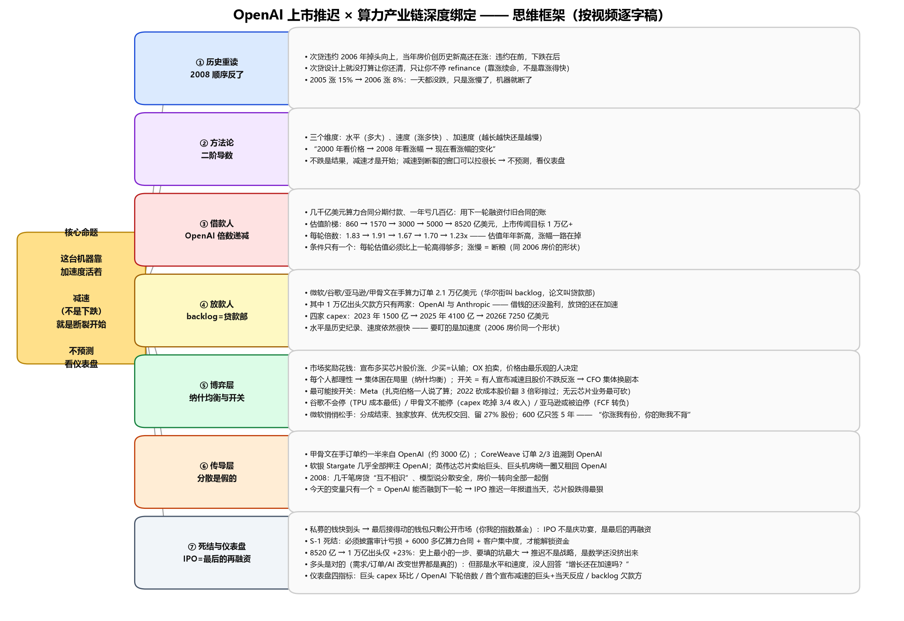
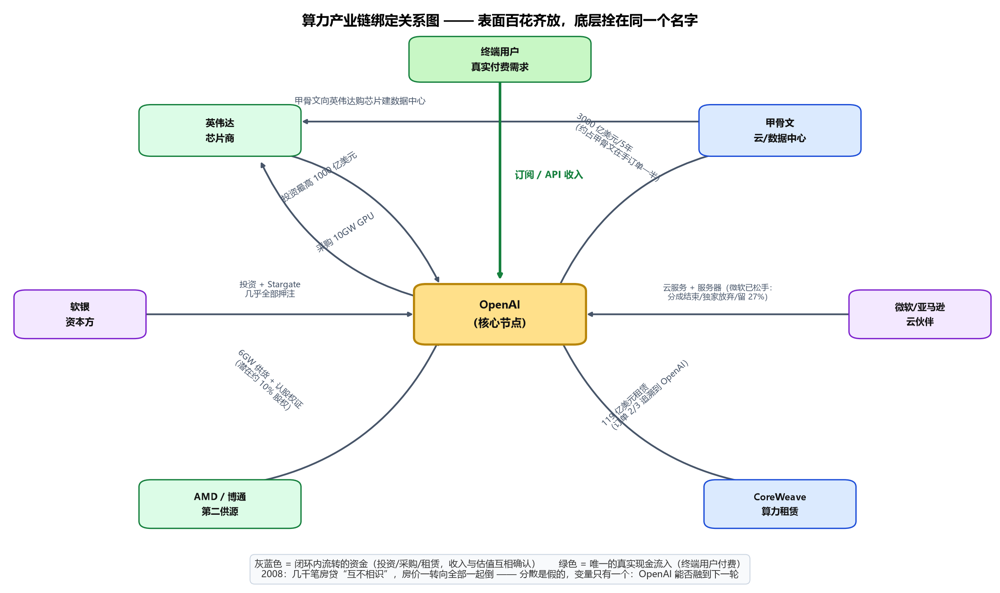
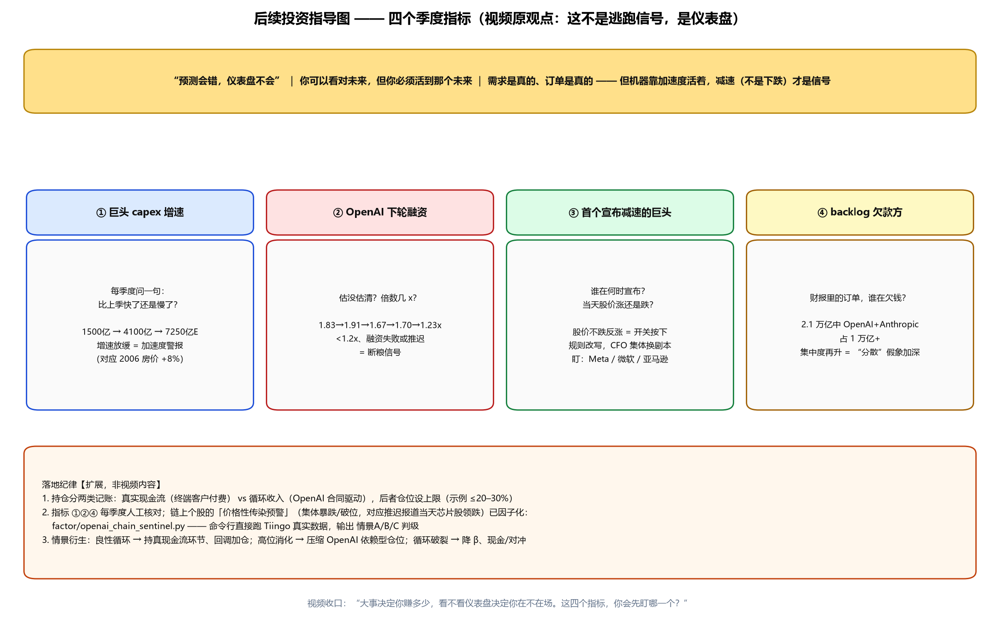

# OpenAI 上市推迟 × 算力产业链深度绑定 —— 思维框架与投资指导

> 按视频逐字稿校准。配图：`思维框架图.png`、`产业链绑定关系图.png`、`投资指导图.png`（由 `render_diagrams.py` 生成）。
> Word 版本由 `build_word_doc.py` 生成。

## 核心命题

- 这台机器靠加速度活着：**减速（不是下跌）就是断裂的开始**。
- 不预测，看仪表盘。

## 一、思维框架：七层逻辑

### ① 历史重读：2008 的顺序反了

- 次贷违约 2006 年掉头向上，当年房价创历史新高还在涨：违约在前，下跌在后。
- 次贷设计上就没打算让你还清，只让你不停 refinance（靠涨续命，不是靠涨得快）。
- 2005 涨 15% → 2006 涨 8%：一天都没跌，只是涨慢了，机器就断了。

### ② 方法论：二阶导数

- 三个维度：水平（多大）、速度（涨多快）、加速度（越来越快还是越来越慢）。
- “2000 年看价格 → 2008 年看涨幅 → 现在看涨幅的变化。”
- 不跌是结果，减速才是开始；减速到断裂的窗口可以拉很长 → 不预测，看仪表盘。

### ③ 借款人：OpenAI 倍数递减

- 几千亿美元算力合同分期付款、一年亏几百亿：用下一轮融资付旧合同的账。
- 估值阶梯：860 → 1570 → 3000 → 5000 → 8520 亿美元，上市传闻目标 1 万亿+。
- 每轮倍数：1.83 → 1.91 → 1.67 → 1.70 → 1.23x —— 估值年年新高，涨幅一路在掉。
- 条件只有一个：每轮估值必须比上一轮高得够多；涨慢 = 断粮（同 2006 房价的形状）。

### ④ 放款人：backlog = 贷款部

- 微软/谷歌/亚马逊/甲骨文在手算力订单 2.1 万亿美元（华尔街叫 backlog，论文叫贷款部）。
- 其中 1 万亿出头欠款方只有两家：OpenAI 与 Anthropic —— 借钱的还没盈利，放贷的还在加速。
- 四家 capex：2023 年 1500 亿 → 2025 年 4100 亿 → 2026E 7250 亿美元。
- 水平是历史纪录、速度依然很快 —— 要盯的是加速度（2006 房价同一个形状）。

### ⑤ 博弈层：纳什均衡与开关

- 市场奖励花钱：宣布多买芯片股价涨、少买 = 认输；OX 拍卖，价格由最乐观的人决定。
- 每个人都理性 → 集体困在局里（纳什均衡）；开关 = 有人宣布减速且股价不跌反涨 → CFO 集体换剧本。
- 最可能按开关：Meta（扎克伯格一人说了算；2022 砍成本股价翻 3 倍彩排过；无云芯片业务最可砍）。
- 谷歌不会停（TPU 成本最低）/ 甲骨文不能停（capex 吃掉 3/4 收入）/ 亚马逊或被迫停（FCF 转负）。
- 微软悄悄松手：分成结束、独家放弃、优先权交回、留 27% 股份；600 亿只签 5 年 —— “你涨我有份，你的账我不背”。

### ⑥ 传导层：分散是假的

- 甲骨文在手订单约一半来自 OpenAI（约 3000 亿）；CoreWeave 订单 2/3 追溯到 OpenAI。
- 软银 Stargate 几乎全部押注 OpenAI；英伟达芯片卖给巨头、巨头机房绕一圈又租回 OpenAI。
- 2008：几千笔房贷“互不相识”、模型说分散安全，房价一转向全部一起倒。
- 今天的变量只有一个 = OpenAI 能否融到下一轮 → IPO 推迟一年报道当天，芯片股跌得最狠。

### ⑦ 死结与仪表盘：IPO = 最后的再融资

- 私募的钱快到头 → 最后接得动的钱包只剩公开市场（你我的指数基金）：IPO 不是庆功宴，是最后的再融资。
- S-1 死结：必须披露审计亏损 + 6000 多亿算力合同 + 客户集中度，才能解锁资金。
- 8520 亿 → 1 万亿出头仅 +23%：史上最小的一步、要填的坑最大 → 推迟不是战略，是数学还没挤出来。
- 多头是对的（需求/订单/AI 改变世界都是真的）：但那是水平和速度，没人回答“增长还在加速吗？”
- 仪表盘四指标：巨头 capex 环比 / OpenAI 下轮倍数 / 首个宣布减速的巨头+当天反应 / backlog 欠款方。

## 二、产业链绑定关系：表面百花齐放，底层拴在同一个名字

- 英伟达 ↔ OpenAI：投资最高 1000 亿美元，换 10GW GPU 采购。
- OpenAI → 甲骨文：3000 亿美元 / 5 年（约占甲骨文在手订单一半）；甲骨文再向英伟达购芯片建数据中心。
- AMD / 博通：6GW 供货 + 认股权证（潜在约 10% 股权）。
- CoreWeave：119 亿美元租赁，订单 2/3 追溯到 OpenAI。
- 软银：投资 + Stargate，几乎全部押注 OpenAI。
- 微软/亚马逊：云服务 + 服务器；微软已松手（分成结束 / 独家放弃 / 留 27% 股份）。
- 终端用户：订阅 / API 收入 —— 整条链唯一的真实现金流入。

> 闭环内流转的资金（投资/采购/租赁）让收入与估值互相确认；2008 年几千笔房贷“互不相识”，房价一转向全部一起倒 —— 分散是假的，变量只有一个：OpenAI 能否融到下一轮。

## 三、后续投资指导：四个季度指标（这不是逃跑信号，是仪表盘）

> “预测会错，仪表盘不会” ｜ 你可以看对未来，但你必须活到那个未来 ｜ 需求是真的、订单是真的 —— 但机器靠加速度活着，减速（不是下跌）才是信号。

### 指标① 巨头 capex 增速

- 每季度问一句：比上季快了还是慢了？
- 1500 亿 → 4100 亿 → 7250 亿E：增速放缓 = 加速度警报（对应 2006 房价 +8%）。

### 指标② OpenAI 下轮融资

- 估没估清？倍数几 x？
- 1.83 → 1.91 → 1.67 → 1.70 → 1.23x：<1.2x、融资失败或推迟 = 断粮信号。

### 指标③ 首个宣布减速的巨头

- 谁在何时宣布？当天股价涨还是跌？
- 股价不跌反涨 = 开关按下，规则改写，CFO 集体换剧本。盯：Meta / 微软 / 亚马逊。

### 指标④ backlog 欠款方

- 财报里的订单，谁在欠钱？
- 2.1 万亿中 OpenAI + Anthropic 占 1 万亿+：集中度再升 = “分散”假象加深。

### 落地纪律【扩展，非视频内容】

1. 持仓分两类记账：真实现金流（终端客户付费） vs 循环收入（OpenAI 合同驱动），后者仓位设上限（示例 ≤20–30%）。
2. 指标①②④ 每季度人工核对；链上个股的「价格性传染预警」（集体暴跌/破位，对应推迟报道当天芯片股领跌）已因子化：`factor/openai_chain_sentinel.py` —— 命令行直接跑 Tiingo 真实数据，输出 情景A/B/C 判级。
3. 情景衍生：良性循环 → 持真现金流环节、回调加仓；高位消化 → 压缩 OpenAI 依赖型仓位；循环破裂 → 降 β、现金/对冲。

---

*视频收口：“大事决定你赚多少，看不看仪表盘决定你在不在场。这四个指标，你会先盯哪一个？”*
